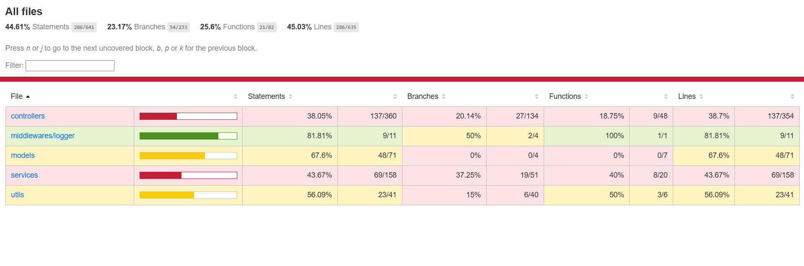

# Pruebas Unitarias

## Implementación de Pruebas Unitarias
Para la capa de servicios, se han creado un total de 29 pruebas unitarias usando Jest y Supertest. Estas pruebas se organizan en el directorio `__test__` con dos carpetas llamadas `controller` y `services` cubriendo las funcionalidades de estas carpetas.

- **Estructura de carpetas de prueba:**  
  - `__test__/controller/` contiene las pruebas de cada código de su respectiva carpeta del server.
  - `__test__/services/` contiene las pruebas de cada código de su respectiva carpeta del server.

### Ejecución de Pruebas
Para ejecutar las pruebas, sigue estos pasos:

```bash
npm test
```

## Ver el reporte de cobertura de las pruebas unitarias

En el directorio `server/coverage/Icov-report/` hay un index.html que se muestra toda la cobertura de las pruebas unitarias.

